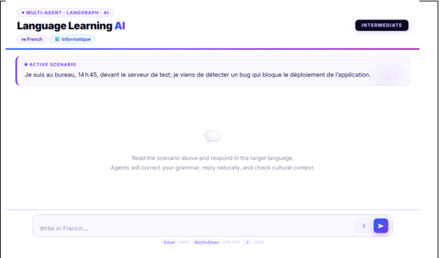
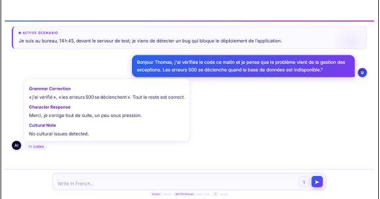
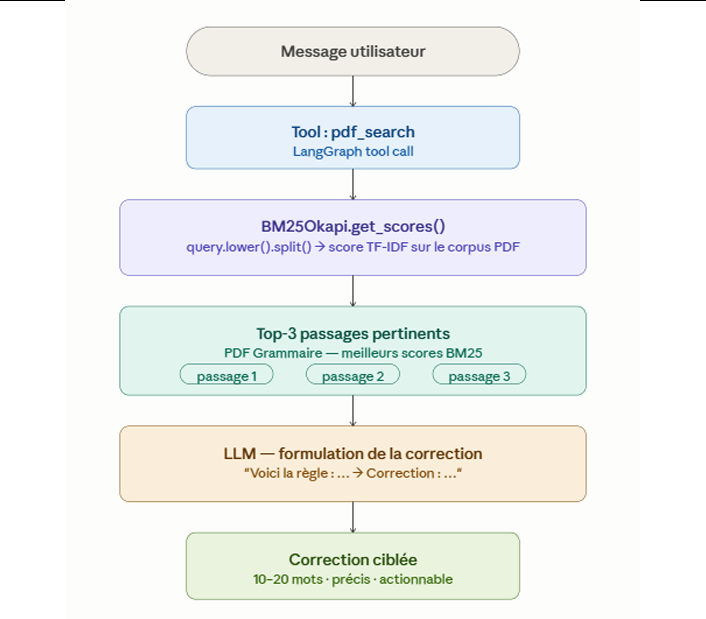
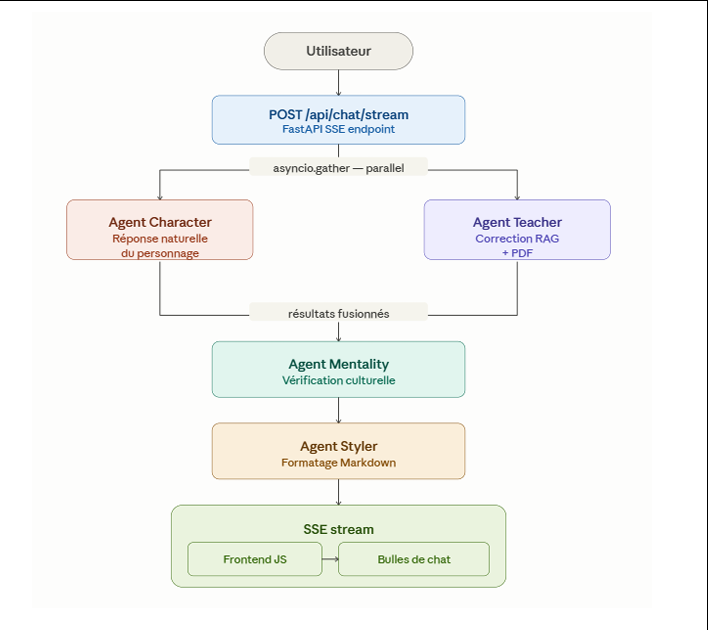
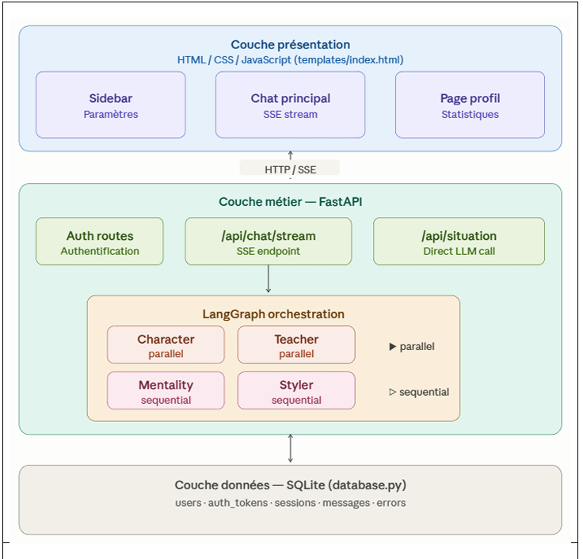

# Projet SMA — Système Multi‑Agents pour l'apprentissage des langues

Plateforme d'apprentissage des langues basée sur un système multi‑agents. Le projet génère des scénarios de conversation, corrige la grammaire via RAG, vérifie la pertinence culturelle et formate la réponse finale. Une interface Web Streamlit et un mode CLI sont disponibles.

---

## Fonctionnalités

- Orchestration multi‑agents (LangGraph)
- Correction grammaticale via RAG (BM25 sur `files/Grammer.pdf`)
- Vérification culturelle et reformulation stylistique
- Sauvegarde des corrections (mode CLI)
- Interface Web Streamlit + interface CLI
- Évaluation de prompts (A/B/C)

---

## Installation

Pré‑requis : Python 3.10+ et `pip`.

```bash
pip install -r requirements.txt
```

Créer un fichier `.env` à la racine :

```
MODELNAME=your-ollama-model
TAVILYAPIKEY=your-tavily-key
OLLAMA_API_KEY=your-ollama-token
LANGSMITH_API_KEY=optional
```

---

## Lancer l'application

Web (recommandé) :

```bash
streamlit run Ui.py
```

CLI :

```bash
python withoutUi.py
```

Évaluation de prompts :

```bash
python prompt_evaluation.py
```

---

## Structure du projet

- `agents.py` — Agents, prompts, outils, RAG
- `workflows.py` — Graphe LangGraph
- `Ui.py` — UI Streamlit
- `withoutUi.py` — CLI
- `prompt_evaluation.py` — Evaluation A/B/C
- `files/Grammer.pdf` — Base RAG
- `picture/` — Captures d'ecran

---

## Architecture (resume)

Flux principal : scenario -> `character` -> `teacher` (RAG) -> `mentality` -> `styler` -> `save_check` -> `save_agent`.

---

## Captures d'ecran

Les images ci‑dessous viennent du dossier `picture/`.

- Interface principale — vue generale annotee
  

- Barre laterale — detail des controles
  

- Page de connexion — onglets Sign In et Create Account
  

- Ecran d'inscription — formulaire Create Account
  

- Page profil — statistiques et historique des erreurs grammaticales
  

- Scenario genere — Exemple: Informatique Intermediaire Francais
  

- Echange de conversation avec corrections — domaine Informatique
  

- Composition du SMA — 5 agents specialises et leurs interactions
  

- Pipeline de l'Agent Enseignant — RAG avec BM25 sur PDF de grammaire
  

- Diagramme de flux des agents — traitement d'un message
  

- Architecture globale du systeme SMA
  

---

## Collaborateurs

- ILYAS MOUSSNAOUI
- MUSTAPHA EL MIFDALI
- HICHAM OUAOUCHE
